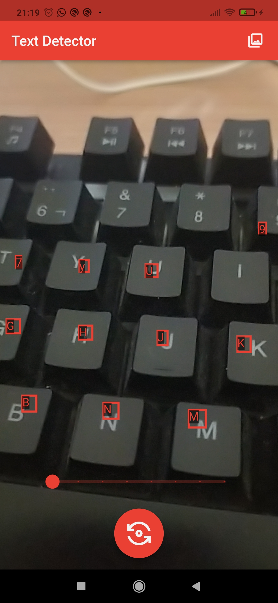
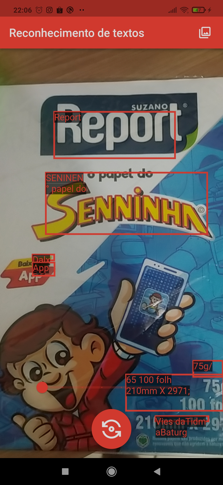

# text_detector_google_ml_kit

## Descrição

Projeto desenvolvido para demonstrar a utilização reconhecedor de textos do Kit ML para Flutter do Google.

Neste projeto uso o KitML para Flutter do Google, Dart Code Metrics, ImagePicker, Path Provider e Camera.

O Kit ML para Flutter do Google que é um conjunto de plugins Flutter que permitem que os aplicativos usem o Kit ML autônomo do Google.

- [Reconhecimento de texto do Kit ML do Google para flutter](https://github.com/bharat-biradar/Google-Ml-Kit-plugin/tree/master/packages/goog le_mlkit_text_recognition)

Um plugin Flutter para usar o ML Kit Text Recognition do Google para reconhecer texto em qualquer conjunto de caracteres chinês, Devanagari, japonês, coreano e latino.

- [Dart Code Metrics](https://pub.dev/packages/dart_code_metrics)

  Dart Code Metrics é uma ferramenta de análise estática que ajuda você a analisar e melhorar a qualidade do seu código e fornece regras adicionais para o analisador.

- [Image Picker](https://pub.dev/packages/image_picker)

ImagePicker é um plug-in Flutter para iOS e Android para escolher imagens da biblioteca de imagens e tirar novas fotos com a câmera

- [Path Provider](https://pub.dev/packages/path_provider)

Um plug-in flutter para encontrar locais comumente usados no sistema de arquivos. Suporta Android, iOS, Linux, macOS e Windows

- [Camera](https://pub.dev/packages/camera)

Um plugin Flutter para iOS, Android e Web permitindo acesso às câmeras do dispositivo.

## Preview

## Começando

Este projeto é um ponto de partida para uma aplicação Flutter.

Alguns recursos para você começar se este for seu primeiro projeto Flutter:

- [Lab: Escreva seu primeiro aplicativo Flutter](https://docs.flutter.dev/get-started/codelab)
- [Cookbook: exemplos úteis do Flutter](https://docs.flutter.dev/cookbook)

Para obter ajuda para começar com o desenvolvimento do Flutter, consulte o
[documentação online](https://docs.flutter.dev/), que oferece tutoriais,
exemplos, orientação sobre desenvolvimento móvel e uma referência completa de API.
